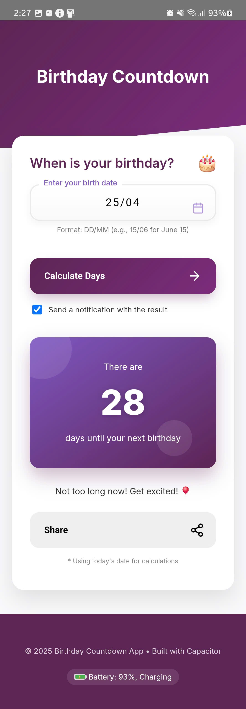
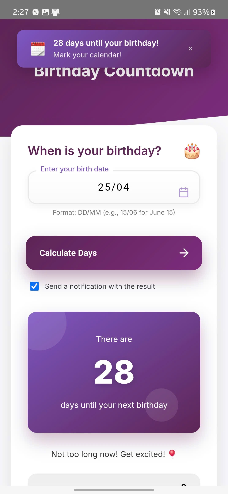
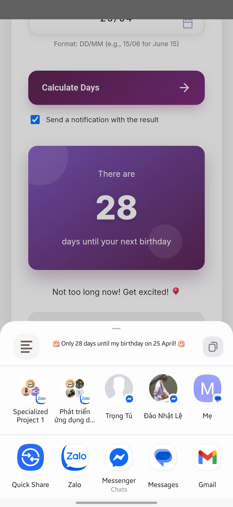

# Birthday Countdown App

A beautiful, modern mobile app built with Capacitor that helps users track days until their birthday and share the countdown with friends. The app features an elegant UI, in-app notifications, and system notifications.



## Features

### 1. Birthday Countdown Calculator
Enter your birth date in DD/MM format and instantly see how many days are left until your next birthday. The app provides personalized messages based on how far away your birthday is.


### 2. Smart Notifications
Receive both in-app and system notifications about your birthday countdown. The notification style changes based on how close your birthday is.



### 3. Social Sharing
Share your birthday countdown with friends and family with just one tap. The sharing message is customized based on your birthday date and countdown.



### 4. Device Integration
- Battery status monitoring
- Device-native notifications
- Responsive design that works across different screen sizes

## Installation

Follow these steps to install and run the Birthday Countdown app:

### Prerequisites
- [Node.js](https://nodejs.org/) (v14 or later)
- [npm](https://www.npmjs.com/) (v6 or later)
- [Capacitor CLI](https://capacitorjs.com/docs/getting-started)

### Step 1: Clone the repository

```bash
git clone https://github.com/thanhdong200425/capacitor-birthday-calculation.git
cd my-app
```

### Step 2: Install dependencies

```bash
npm install
```

### Step 3: Build the web application

```bash
npm run build
```

### Step 4: Add platforms

#### For Android:

```bash
npx cap add android
```

#### For iOS:

```bash
npx cap add ios
```

### Step 5: Copy web assets to the native platforms

```bash
npx cap copy
```

## Running the App

### Web Development Server

To run the app in a web browser during development:

```bash
npm run dev
```

This will start a development server, typically at `http://localhost:5173/`.

### Running on Android

Make sure you have Android Studio installed, then:

```bash
npx cap open android
```

This will open the project in Android Studio, where you can run it on an emulator or physical device.

### Running on iOS (requires macOS)

Make sure you have Xcode installed, then:

```bash
npx cap open ios
```

This will open the project in Xcode, where you can run it on a simulator or physical device.

## Updating Native Code

After making changes to your web code:

1. Build your web app:
```bash
npm run build
```

2. Copy changes to native projects:
```bash
npx cap copy
```

3. Update native plugins (if needed):
```bash
npx cap sync
```

## Project Structure

- `src/`: Web application source files
  - `js/`: JavaScript files
    - `birthday-app.js`: Main app component 
  - `css/`: Stylesheets
  - `assets/imgs/`: Images used in the app
- `android/`: Android project files
- `ios/`: iOS project files (if added)
- `capacitor.config.json`: Capacitor configuration

## Technologies Used

- [Capacitor](https://capacitorjs.com/) - Cross-platform native runtime
- Modern JavaScript with Web Components
- CSS3 with animations and modern layout techniques

## License

This project is licensed under the MIT License - see the LICENSE file for details.
